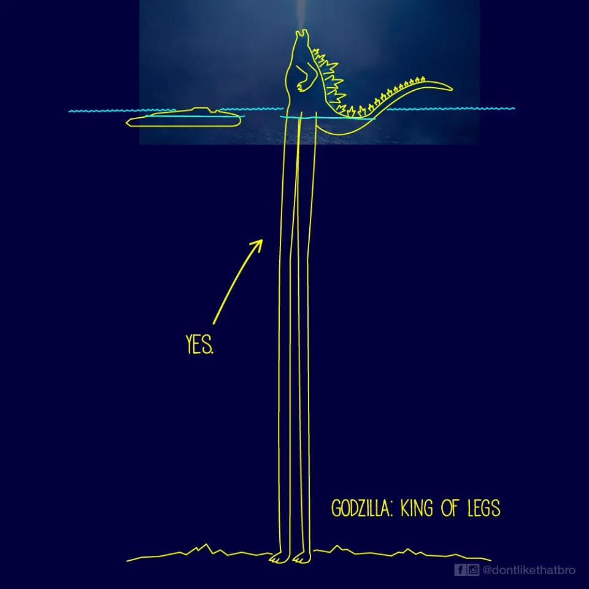

> Trigger Warning (Attention)
>
>
> J'aborde la mort, la guerre, et les meurtres de masse atomiques. \
> L'article est léger, mais par moment je suis très sérieux !

[
](https://wikizilla.org/wiki/Godzilla_(1954_film)#/media/File:Godzilla_Movie_Posters_-_Gojira_-French-.jpg/2)

Bonjour tout le monde. Aujourd'hui je vais vous parler de Godzilla, le tout premier film.
Il est sorti en 1954 au Japon, donc bon c'est pas un truc très récent. Pourtant tout y est.
Tout ce qu'on connaît de Godzilla est là.

Je ne vais pas vous faire un résumé du film ou vous raconter l'histoire. Pour ça je vous invite à aller
lire le [wikizilla(en)](https://wikizilla.org/wiki/Godzilla_(1954_film)) or [wikipedia(fr)](https://fr.wikipedia.org/wiki/Godzilla_(film,_1954)).

Nan, ici je vais surtout vous montrer quelques parties afin de vous convaincre que oui c'est un bon film, et oui (aussi) tout ce
qui est iconique dans les godzilla modernes a été pensé depuis le début! Ces gens étaient des visionnaires 😛



## A voir ou pas ?

Je l'ai déjà dit dans l'intro, mais ce film est un [banger](https://fr.wiktionary.org/wiki/banger). Il est absolument à voir. Mettez vos attentes à la Michael Bay dans
le placard le temps du visionnage car même si le film a bien vieilli sur plein d'aspects, il reste plutôt lent et possède ce rythme
caractéristique des films des années 50-60. Pensez-y comme un *2001 odyssey de l'espace*, prenez votre impatience en patience, écoutez (ou lisez) bien les
dialogues, et posez votre téléphone dans le placard avec Michael Bay.

REGARDEZ ce film, il est absolument génial, surtout si vous avez déjà vu d'autres godzilla plus modernes, comme le *Godzilla Minus One* de 2023, vous allez kiffer.

> Je vais évidemment divulgâcher des parties ici, mais restez rassurés que je vais soigneusement vous cacher quelques bouts intéressants.
>
> Et puis le spoil [ne gâche jamais un bon film](https://www.youtube.com/watch?v=Nu63QSuahII) 😉

## Ses premiers rugissements en musique

Les bruits de pas lourds, sursaturés, annoncent ce qu'on sait qui arrive. Un gros truc, effrayant, terrifiant.

Puis le film s'ouvre avec l'iconique, l'unique, le très spécial *Le Cri* de Godzilla.
Un son qui le caractérise et qui le suivra tout au long de sa carrière.
Enfin je pense, j'ai pas encore vérifié, mais je commence.

La toute aussi iconique et majestueuse musique qu'on connaît tous (oui oui, toi aussi) vient habiller ces sons aussi désagréables que jouissifs. Composée par [伊福部 昭 Ifukube Akira](https://fr.wikipedia.org/wiki/Akira_Ifukube)
il va créer ce qui sera aussi bien une icône musicale qu'une inspiration pour tant de réalisateurs (Spielberg inclus).



Personnellement, ce début me met la chair de poule depuis que j'ai vu tous les films (plus) récents. C'est comme du fan service inversé, qui retourne à la source.
Un plaisir qui ne fait que commencer.

 > Je ne vais pas traduire les vidéos, donc paroles et texte affiché resteront dans les versions originales. Il n'est pas nécessaire de traduire pour comprendre mon propos normalement.
 >
 > Ici, les textes sont "seulement" les noms des personnes impliquées dans le film, c'est le générique. Ils étaient au début à l'époque, ce qui fait que le film se finit de manière
 > très abrupte sans le traditionnel (pour notre époque) générique montant.

## Un film de Kaiju, nan LE film de Kaiju

Ce film est souvent considéré comme ayant défini le style des films de [Kaiju](https://fr.wiktionary.org/wiki/kaiju). Dans ce style, on retrouve en gros
 - L'utilisation de maquettes pour les effets d'échelle
 - Des gens dans des costumes de monstre
 - Des monstres loufoques, avec des gueules … particulières dirais-je.
 - Souvent les monstres sont énormes, d'où les effets d'échelle nécessaires

Ce film de 1954, je le rappelle, contient donc son lot de scènes particulièrement saisissantes ayant vraiment bien vieilli.
Bon, je dis ça, mais il faut faire abstraction du fait que le film est en noir&blanc, et que oui on voit très bien que c'est des maquettes. Cependant,
le rendu reste cohérent, et aujourd'hui prête à sourire, mais ne rend pas moins percutant le film.

On a dès le début une petite scène qui permet de bien se rappeler de tout ça, un simple bateau qui coule. Je trouve que les effets de feux sont
particulièrement convaincants. Ce ne sont que les mouvements subtils sur l'eau qui trahissent l'échelle réelle de celui-ci.



Et un peu plus tard, c'est une scène d'orage qui malmène des acteurs, pas très bons acteurs. Bon, en fait si, ils sont très bons.
C'est juste que les codes de l'époque ne sont pas les mêmes qu'aujourd'hui. Ce que je trouve surjoué, était la norme avant.
Dans tous les cas, c'est rigolo à regarder, et c'est un bon moyen de calibrer mes attentes pour le reste du film. Plutôt que
de le regarder avec dédain, je vais le regarder avec émerveillement, appréciant tout surjeu à sa juste valeur. Parfois, il est vrai, en
rigolant à gorge déployée. Ça fait partie de l'expérience maintenant.



Clairement, le travail de construction et de mise en lumière est tout bonnement saisissant. Oui on ne se fait pas berner par
les effets d'échelles car les caméras de l'époque ne permettaient pas ce que nous pouvons aujourd'hui, mais bon, on sait que c'est impressionnant.
Personnellement, je ressens tout l'amour des maquettistes et modélistes dans ces plans. Et ça sera comme ça tout le long du (des?) film(s).

## Mais où est le monstre ?

Le film prend son temps; vraiment. Construit autour de 3 actes, le premier prend bien un bon gros tiers du film. On nous parle de folklore,
d'histoire de vieux pêcheur qui raconte que jadis un monstre avait été aperçu quand le poisson venait à manquer. Son nom ? Gojira (Godzilla).

Et voilà, le nom de ce dinosaure préhistorique est scellé pour toujours. Dans le film c'est cette histoire qui sert de justification pour nommer le monstre quand
des journalistes ont besoin d'un gros titre pour leur édition spéciale.

Cependant, pas de monstre à l'écran. Il y a eu de la destruction, des bruits, mais rien de visuel. Premier indice et première caractéristique de ce monstre invisible
qui se forge, là aussi pour l'éternité: une énorme trace de pas en plein milieu d'un village. Une trace **radioactive** ! Notre monstre est **RADIOACTIF**.



Donc là on apprend que le truc est gros. Téma la taille de l'empreinte.
Aussi, le truc est radioactif !! Le compteur Geiger s'affole, on l'entend bien.

> Godzilla est donc:
> - Gros / Grand
> - Radioactif

Quelques minutes plus tard, on voit des trilobites qui traînent. Des [TRILOBITES](https://fr.wikipedia.org/wiki/Trilobita),
le truc sensé être éteint depuis des centaines de millions d'années. Godzilla a donc ramené des trucs de chez lui, des vieux trucs.
Rien ne suggère que ça soit volontaire de sa part, mais plus que ces bêtes l'accompagnent en tant que parasites (symbiotiques?).
Ils en sèment quelques-uns sur son passage du coup.



> Godzilla est donc:
> - Vieux (ou du moins traîne avec des vieux de 250 millions d'années)

Et là c'est le drame. Un villageois sonne l'alerte générale et tout ce petit monde qui faisait tranquillement ses mesures et ces prélèvements d'échantillons
se précipite pour offrir un champ contre-champ tout à fait saisissant.

Nan, en fait c'est surtout très comique aujourd'hui 😁. J'imagine bien les acteurs se placer sur leur marque, avec le réal qui
insiste: "Imaginez que cette caméra se révèle à vous, rugit, fait des dizaines de mètres de haut, est terrifiante !!". Bref, les débuts
de l'acting sur écran vert,… sans écran vert.

Godzilla est enfin révélé. Sa taille enfin comparable au reste du monde. Une incrustation sans faute, qui même aujourd'hui rend très bien.

Admirez donc cette personne dans un costume jouer le gros monstre, devant une (petite) foule terrorisée. Un rêve de gosse!



Je ne peux m'empêcher de considérer la ribambelle de scientifiques, reporters, et autres explorateurs qui font face à la caméra comme
relevant d'un effet comique. Pareil pour la "terreur" sur chaque visage. Mais pardon, replaçons ce film dans son époque, c'est terriblement bien joué !

La révélation à la fin avec les traces sur la plage … Magnifique !

Donc ouais, c'est bien fait, mais c'est chiche pour le moment. Quasiment que de la suggestion. On dirait du Spielberg (ou est-ce que c'est Spielberg qui ressemble à du [本多 猪四郎 Honda Ishirō](https://fr.wikipedia.org/wiki/Ishir%C5%8D_Honda)? 😏)

## Le costume


Avant d'aller plus loin, un petit mot sur le costume.

Le [ShodaiGoji (初代ゴジ)(en)](https://wikizilla.org/wiki/ShodaiGoji).

Je vais pas paraphraser tous les articles et wikis qui en parlent, mais il faut malgré tout garder en tête quelques infos intéressantes,
notamment quand on regardera les prochains extraits.

Le costume est un truc en caoutchouc sur une armature en bois et métal (si j'ai bien compris), avec du coton et tissu à l'intérieur pour un effet doux
(nan, c'est faux, c'était juste pour pas que le truc ne soit qu'une lame tranchante pour l'acteur).

Bref, le point important c'est que ce truc est loin d'être un simple pyjama. Ça pesait près de 100Kg le bordel. Imaginez-vous là-dedans, alors qu'il
y a des barres de fer partout, que vous devez "jouer le monstre" et vous rouler par terre avec !

Ouf, toutes les parties qui bougent sur la tête sont actionnées par ailleurs, c'est quelqu'un d'autre qui s'y colle. Mais quand même, fallait
se trimballer le truc et tout détruire "proprement" comme le réalisateur voulait. Pas de seconde prise, sinon faut refaire toutes les maquettes.



## Révélations

Bon, les vieux pêcheurs avaient raison. Nous on le savait, on avait vu le titre de ~la vidéo~ du film. Mais il fallait que les
personnages du film le voient de leurs yeux-vus ! (ouais c'est un seul mot chez moi, "yeux-vu". C'est notre œil critique m'voyez)

Comme j'ai déjà vu pas mal de films godzilla, je remarque encore un motif récurrent se poser bien comme il faut.
Ouais, j'ai pas vu tous les films dans l'ordre hein, j'ai bien dû commencer par les récents avant d'évoluer en une version meilleure de moi-même qui peut prendre son impatience en patience!

Donc, je disais quoi ? Ah oui, comme j'ai déjà vu pas mal de films godzilla je remarque une scène plutôt curieuse. Le powerpoint™ de l'époque à base de transparents, comme à l'époque (ouais chuis vieux, y avait pas de tableau "interactif" quand j'étais au collège/lycée).

Cette scène, repérez-la bien, elle va devenir classique dans la franchise. Perso, je trouve ça comme un running gag, mais là c'est sérieux. C'est le premier
film, et ça ne rigole pas.



C'est la séance de rattrapage pour tous ceux qui regardaient leur téléphone pendant toute la première partie.
Je vous avais dit de le ranger, vous avez de la chance que le prof fasse un cours de rattrapage !

On n'apprend pas grand-chose, mais tout est récapitulé. En gros:

> Godzilla est:
> - Gros / Grand
> - Radioactif
> - Vieux ou traîne avec des vieux

On a même droit à un mugshot de godzilla à la fin.

Ah si, j'ai failli oublier, on apprend quand même un nouveau truc. Les persos du film font une conjecture sur la raison de la venue ou du réveil
de godzilla. Car oui, les vieux pêcheurs parlent d'une vieille légende (même pour eux). Donc pourquoi il revient maintenant ?

C'est là qu'on arrive au fondamental de ce que représente Godzilla. Du moins dans ce film-ci. Car je trouve que ça change un peu dans les suivants.

Godzilla est revenu, car on a foutu le bazar sur les fonds marins, là où il habitait/hibernait (rayez votre choix moinsféré). Et en plus on y est pas allés
avec le dos de la main morte! On l'a atomisé le truc. Genre Bombe A, Bombe H, etc…

On sait tous que c'est vraiment chiant quand le FBI ou le GIGN vient "gentiment" défoncer votre porte et votre logement à coups de
erquisition atomique. Donc c'est un peu normal que le pauvre Godzilla soit énervé et vienne foutre le bazar dans notre chez-nous. Il vient piétiner
nos massifs!

Il est suggéré que le fait que Godzilla soit si gros et possède des super-pouvoirs (on va le voir après), soit le résultat des radiations de nos essais nucléaires.

Godzilla il a plus de chez lui. Probablement qu'on a buté toute sa famille, et il en a gros! Gare à nous!

Plus sérieusement, Godzilla représente les conséquences de l'utilisation de l'arme atomique.
Ce film arrive à peine plus de 10 ans après le meurtre de masse de civils perpétré par les USA sur Hiroshima, et Nagasaki.

Même si le Japon est en pleine colonisation impériale subie par les USA, ce film parle des conséquences d'armes aussi puissantes que les bombes atomiques.
Godzilla lui-même sera un destructeur, et qu'il ait une agentivité ou non ne change rien au propos basique: Plein de gens sont morts.
Si godzilla lui-même est un être sentient et pensant, sa volonté peut alors facilement être une métaphore de celle des USA. Une sorte
de vengeance pour avoir détruit son chez-soi (Pearl Harbor?). Si l'impérialisme Américain sur le Japon est à l'œuvre dans ce film, c'est probablement
dans ce petit bout de lore (d'histoire). Une sorte de "bonne" raison de tout détruire. On le verra par la suite avec … les suites, mais cet angle d'analyse
semble vraiment bien survivre et se renforcer d'épisode en épisode.

Bon, allez, on revient sur un plan plus léger, pour rigoler un peu plus avec ce film.

## Scène de destruction

Maintenant que notre ami sans famille est clair pour tout le monde, même pour les personnages du film, il va enfin pouvoir venir tout péter.
Les pauvres humains vont tenter de sortir les gros moyens. Un classique là aussi, où presque tout le Japon est mis à contribution, un peu à la façon Évangélion.
(ou est-ce Évangélion qui est à la façon Godzilla 😏).



On tente d'électrocuter ce gros lézard avec tout ce qu'on a. Les effets sont classiques pour l'époque, je suppose que la pellicule a été simplement peinte pour
faire les effets électriques. On voit bien comment une personne peut se cacher dans ce monstre. Mais ça le rend encore plus touchant, quand lui-même touche
les lignes à haute tension comme si c'était une toile d'araignée.

Notez que cette combinaison qui pèse déjà 100kg a dû être opérée dans l'eau! J'imagine même pas l'endurance physique nécessaire pour ça.

Bon, tous les canons se déchaînent sur godzilla, pendant que celui-ci casse les tours Légo faites par le frangin sans même se rendre compte
que toute l'artillerie s'y met.

Je ne sais pas comment les maquettistes prennent la destruction de leurs œuvres. Est-ce qu'ils sont heureux ? Tristes ? Les deux ? Autre chose ? En tout
cas ça rend bien. Ça se plie comme il faut, enfin presque. La fumée partout rend le tout encore plus digeste, mais casse complètement la perspective et les effets
d'échelle.

Ensuite, on découvre pour la première fois en imax 4d dolby atmos, sans odorama, l'haleine fétide de godzilla qui fait tout fondre. Le heat ray
qui tue.



Notez qu'on voit notre ami de près, et qu'est-ce qu'il est hideux ! Franchement il est réussi tellement il est moche.

Bon, c'est pas le tout, mais il a encore plein de trucs à détruire, et passé les défenses humaines, c'est la ville de Tokyo qui
va prendre cher.



Visuellement, c'est magnifique. Les bâtiments en feu sont vraiment crédibles. Dommage pour Godzilla qui fait un regard caméra qui a dû
passer à la trappe lors du montage. Ils auraient pu faire une autre prise franchement.

Aussi, très saisissant cet accident Hotwheels™ 😁. Ça contraste pas mal avec les explosions dignes des films des années 80. Je passe sous silence les accélérés, qui sont
vraiment un classique pour l'époque; d'ailleurs plutôt subtils ici.

Et la fin avec cette patte, non, cette cuisse de Godzilla qui remplit tout le cadre; Magnifique! Pour finalement montrer l'adresse avec laquelle l'homme
dans le costume va détruire cet entrepôt en ne montrant qu'un petit bout de cette cuisse, non de cette patte; Magnifique!

Et notez la qualité de l'incrustation de godzilla quand les villageois s'enfuient de terreur! Du grand art (technique)!

Un petit extrait où Godzilla se positionne politiquement et crie [ACAB](https://fr.wikipedia.org/wiki/ACAB) à sa façon!



Je vous mets cet extrait car ce qui est évidemment intéressant ici, c'est les incrustations des gens dans les immeubles, et à la fin de l'extrait quand on le voit
en fond de la ville. Ville qui brûle dans sa totalité. Observée par des villageois incrustés en bas. Un rendu vraiment poignant.

Autre motif, ou plutôt devrais-je dire autre setup, les journalistes sur les toits qui font leur taf. Ça décrit, ça filme, ça enregistre. Rien ne les en empêchera
de faire leur boulot, jusqu'au dernier moment, pas même ce gros T-rex à gros bras. Bon, dans ce film, ils sont un peu pleutres, et sont restés bien à l'écart pour
pas sentir la mauvaise haleine de Godzilla.



Notons au passage que Godzilla n'aime pas trop les horloges. Aucune explication n'est jamais fournie concernant cette haine viscérale. C'est une
totale libre interprétation pour le spectateur. Pauvre horloge…

Les humains sont peut-être petits, mais ils ont des petits avions et c'est un autre setup ici. Godzilla versus les avions.
Ici, désolé je vais vous gâcher la surprise, les vionvions, ils gagnent pas.



La musique, est aussi vraiment parfaite pour ce moment. Un régal! On dirait presque un clip de Michel Jackson au début.
On attendrait que godzilla se mette à danser comme un zombie. Mais nan, il laisse juste les grands enfants jouer aux avions quelques minutes avant
de se rappeler que *Parent 2* a dit "à table" y a déjà bien 10 minutes et s'en va dans la baie de Tokyo pour aller manger.

Si vous avez l'œil. Ou surtout juste si vous avez enfin rangé votre smartphone au placard comme je vous l'avais dit, vous apercevrez les techniques sophistiquées de guidage des roquettes.
Les missiles, pas la salade hein. Probablement un truc très technologique à base de [*c12h22n2O2*](https://fr.wikipedia.org/wiki/Nylon).

## Les conséquences



[
](https://commons.wikimedia.org/wiki/File:Hiroshima_aerial_view_after_atomic_bomb_8-1945.jpeg)

Bon, ici on va redevenir sérieux quelques instants.

Le film prend une tournure très sinistre, même pour notre époque. Car si aujourd'hui on ne perçoit
pas la terreur et la catastrophe au travers des images, comme ça a pu être le cas à l'époque quand on n'était pas habitué aux effets 3D ultra réalistes,
on retombe très vite sur notre bonne vieille réalité. Pour avoir visité le musée de la paix de Hiroshima, et donc vu quelques clichés et, plus horrible encore, quelques dessins et récits
des conséquences de ce meurtre de masse de civils par les USA en ce 6 août 1945 à 8h16, je peux dire que cette partie du film est plutôt glaçante.
C'est un film, et époque oblige, les images sont très "propres", mais suggèrent largement ce qu'il faut, et ne s'économisent pas d'images difficiles.

La représentation de Tokyo après le passage de Godzilla ressemble en tout point à Hiroshima quelques heures après l'explosion.
Du moins, de ce qu'il nous en est parvenu.

[
](https://commons.wikimedia.org/wiki/File:Fukuromachi_Elementary_School_Peace_Museum01.JPG)

L'hôpital improvisé rappelle l'histoire (nombreuse) de ces endroits qui ont servi de refuge, et de centre d'aide post-apocalypse. Personnellement, je repense à [cette école (en)](https://en.wikipedia.org/wiki/Fukuromachi_Elementary_School_Peace_Museum)
qui avait "survécu" grâce à sa technique de construction en béton armé malgré sa proximité avec le lieu de détonation de la bombe.
La scène du film m'y replonge, tellement la structure et les murs y ressemblent.
Sûrement que cette architecture est répandue au Japon, mais ici je ne peux m'empêcher de faire le rapprochement avec l'escalier où des survivants ont écrit les noms de ceux qu'ils cherchaient.

[
](https://www.tripadvisor.ca/Attraction_Review-g298561-d8178491-Reviews-Fukuromachi_Elementary_School_Peace_Museum-Hiroshima_Hiroshima_Prefecture_Chugoku.html#/media/8178491/?type=ALL_INCLUDING_RESTRICTED&albumid=-160&category=-160)

Le film rappelle ici son propos, au cas où le spectateur aurait oublié; \
Où j'aurais oublié; \
Où tu aurais oublié; \
Où nous aurions collectivement oublié. \



Ces écoliers qui chantent… Je n'ai pas la traduction de leurs chants, les sous-titres du film en ont fait l'économie. Mais clairement ça touche, c'est fort.

Je n'en parle pas pour vous garder un peu du film à découvrir, mais ce second passage est loin d'être anodin, et sert pleinement le propos du récit.
Il fait avancer l'histoire d'une manière… Bref, regardez le film (ou lisez le résumé complet) si vous voulez savoir. Je ne veux pas tout aborder ici.

Petit aparté concernant le plan de l'image dans la télé. C'est un autre motif récurrent des films Godzilla.
Clairement, ici les images de destructions sont mises à l'intérieur d'un autre écran, comme si elles-mêmes étaient de la fiction.
Un double niveau de fiction, pour que les personnages puissent encore (un peu) nier la réalité de cette désolation, mais c'est plus possible.

## La fin

Sans vous révéler comment, sachez que les humains, plus exactement les humains Japonais, finissent par gagner contre Godzilla.



Notez que Godzilla marche bien sur le fond de l'océan. Il ne flotte pas. Du moins pas ici.



Le film termine sur un bateau qui prend cher, avec un godzilla agonisant tel un enfant de 5 ans le ferait dans sa baignoire.
Du moins, au début. Après c'est plus le délire d'un paléontologue.

Notez que la mort de Godzilla ne fait aucun doute. Il est vaincu, détruit, littéralement dissous dans l'eau.
Rapide, direct et douloureux à en croire les traducteur·ices officiels de ses rugissements.

Voilà, le spoil est fait, et fini. Il meurt à la fin. Cela n'a pas empêché de faire des dizaines de suites canoniques, donc
ne vous sentez pas détenir tout le savoir et la puissance dans vos mains. Il y a encore bien à découvrir.

## Ma dernière bafouille

Bon, ce film est un chef-d'œuvre. Le·la premier·ère qui dit que j'exagère n'est juste pas digne de recevoir tout ce divertissement, et devrait retourner jouer aux billes ou aux Pogs.

C'est d'époque aussi. D'un côté très fun malgré lui, sans jamais tourner au nanard. D'un autre côté complètement dépassé, mais on lui pardonne c'est d'époque on a dit.

Le propos du film est intéressant, plein d'espoir (Godzilla est vaincu) et de tristesse (les conséquences, et les moyens utilisés pour le vaincre).
Comme j'ai pas tout dit, vous allez devoir creuser par vous-même pour comprendre ce que je veux dire par là. Car ici, mon but est double. Premièrement vous faire
vivre le film, ou du moins une partie, comme moi. Vous partager mon excitation, mes déceptions (y en a pas là), ma tristesse, et mes réflexions et analyses.
Que l'idée saugrenue de regarder TOUS les Godzilla passe d'idée… *saugrenue* justement à une révélation d'évidence pour vous (On a tous le droit de rêver).
Tout ça pour mon second objectif, vous convertir. Que vous deveniez fan de Godzilla.
Mais pas juste un fan de son aspect divertissant, de ses destructions, du chaos qu'il crée (oui tout ça c'est trop cool), mais aussi de ce qu'il représente.
De ce que Godzilla montre, au travers des époques. Car faut bien se rappeler que des films godzilla, il s'en fait et plein depuis celui-ci en 1954!!!.

Ce premier opus pose les bases. On le voit, tout est là et sera repris, remixé, réinventé, copié, plagié, innové par la suite. Je me devais de prendre le temps
sur ce film. Il est fort probable que je serai beaucoup plus succinct sur les dizaines d'autres. Sinon ça va me prendre toute une vie d'écrire ces articles, en espérant que je tienne le rythme 😅.

À bientôt pour la suite. Je l'ai déjà vu, reste à clipper et écrire.

Merci infiniment de m'avoir lu,\
[Bisoux](/page/bisoux) :kissing:


