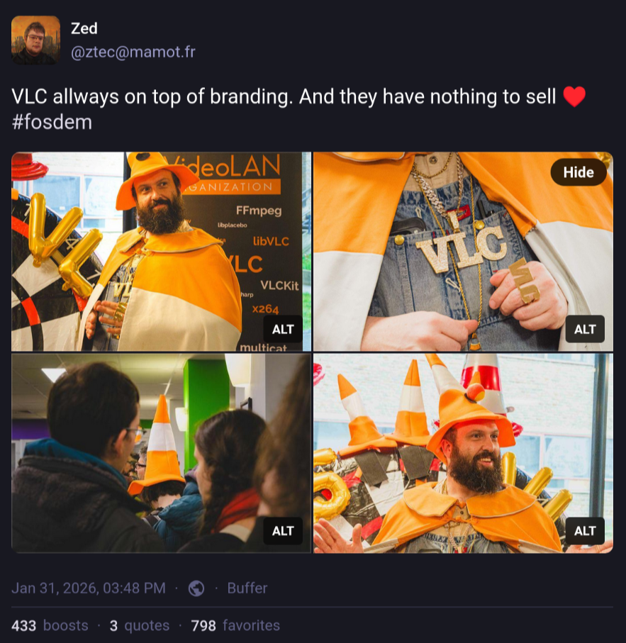

## Société

 - [Y a-t-il un instinct paternel?](https://www.youtube.com/watch?v=4OLzR7UtX9g) (Youtube | Podcast)

J'ai personnellement déjà pas mal lu et écouté sur le sujet, mais cette fois je trouve qu'il y a
pas mal de liens scientifiques permettant de rendre le propos plus solide et remettent beaucoup d'idées
reçues en place.

 - [Pourquoi on vous ment autant sur le Japon (et pourquoi vous y croyez)](https://www.youtube.com/watch?v=WDwmud4RRgU) (Youtube | Podcast)

En lien avec le loot sur la Chine, une vidéo qui explique pourquoi nos médias disent n'importe quoi sur le Japon, et
par extension probablement sur tous les pays asiatiques.

## Chine

 - [Le Soleil Rouge réveille l'Occident](https://www.youtube.com/watch?v=0jrKwNyEyB4) (Youtube)

Une petite vidéo qui remet les préjugés en place. À voir absolument.

## IA

 - [Why do AI company logos look like buttholes? • VelvetShark (en)](https://velvetshark.com/ai-company-logos-that-look-like-buttholes)

Rigolo et sérieux à la fois, rien à ajouter 😁



## USA, Fascisme, et énergie renouvelable

 - [You are being misled about renewable energy technology. (en)](https://www.youtube.com/watch?v=KtQ9nt2ZeGM) (Youtube)

Alors comme d'habitude, Technology Connections fait une vidéo très intéressante, et même si le sujet n'est pas aussi saugrenu que ces deux vidéos
de 2h sur le fonctionnement des lave-vaisselle, c'est ici très pertinent et bien géré. J'aime beaucoup comment il remet les ordres de grandeur
en tête pour montrer les conneries qu'on fait en tant que société.



Mais je partage la vidéo ici non pas pour son sujet premier, mais pour sa partie plus inhabituelle sur les soucis que les USA rencontrent
avec les conséquences du fascisme en place. Il sort de "son devoir de réserve" je dirais. Non pas qu'il en ait un, mais c'est comme un
trait partagé par beaucoup de créateurs de contenu de ne surtout pas parler politique. Alors même qu'ils le font quand même sans s'en rendre compte.
Non, ici il prend ses responsabilités, prend un risque (face au harcèlement qu'il va probablement subir), et dit les choses clairement. Suffisamment
clairement pour donner des instructions précises de vote, sans masquer les "imperfections" de choix. Avec tout ce qui se passe aux USA en ce moment,
ça fait plaisir de voir ce genre de contenu. C'est un rappel que des gens s'opposent à ce qu'il se passe,
comme le rappelait BLAST aussi dans sa vidéo [FACE À L'EXTRÊME DROITE, LA RÉSISTANCE S'ORGANISE](https://www.youtube.com/watch?v=PtiqmybJb5c).

Je ne vais pas m'étendre davantage sur le sujet, mais j'espère voir plus de créateurs prendre ces positions publiquement, et je souhaite tout le courage
du monde à Technology Connections (ouais je sais pas comment le gars s'appelle), pour supporter les attaques dont je suis certain qu'il va subir.



## Tech

### Sécurité

 - [Eargapping (en)](https://www.jwz.org/blog/2025/12/eargapping/)

Je pensais pas que les soucis de sécu du Bluetooth étaient aussi graves.

### Kubernetes

- [Le premier intérêt de Kubernetes n'est pas le scaling](https://mcorbin.fr/posts/2025-12-29-kubernetes-scale/)

Juste un petit rappel qui va de pair avec [Dear friend, you have built a Kubernetes (en)](https://www.macchaffee.com/blog/2024/you-have-built-a-kubernetes).

### FOSDEM



Ce weekend je l'ai passé à Bruxelles pour le [FOSDEM](https://fosdem.org). J'y vais tous les ans depuis 2019. (en ligne en 2021 et 2022 à cause de la pandémie).
Cette année, la [keynote d'ouverture](https://fosdem.org/2026/schedule/event/SFKNTZ-welcome_to_fosdem_2026/) était particulièrement émotionnelle,
 avec le rappel que le FOSDEM est un évènement politique, et que l'état du monde n'est pas très engageant en ce moment.
 Je vous recommande le replay pour vous rendre compte de l'ambiance à ce moment-là.

Quelques talks que je vous recommande de regarder (dès que les replays seront disponibles) :



 - [Evolving Git for the next decade (en)](https://fosdem.org/2026/schedule/event/HTJK33-evolving_git_for_the_next_decade/)

Git a 20 ans, mais est loin d'être terminé. Très bonne conf sur les prochaines évolutions prévues,
et pour moi la découverte de Jujutsu qui sert d'inspiration pour de nouvelles façons d'utiliser Git. Il faut
que je regarde en détail.

 - [How to Make Package Managers Scream (en)](https://fosdem.org/2026/schedule/event/DCAVDC-how_to_make_package_managers_scream/)

Autre conf que je recommande chaudement avec sa copine de 2018 qui est dans la même veine. Très drôle !
L'audience était très participative et dynamique. Un plaisir d'y avoir assisté.

 - [The state of Go (en)](https://fosdem.org/2026/schedule/event/T9HSYY-the-state-of-go/)

Tous les ans, la salle Golang est un incontournable pour moi, et avec la présentation "state of go" un plaisir
à regarder. Courte, simple, drôle, et instructive. À regarder pour se tenir à jour des évolutions du langage.
Même les anciennes années sont instructives, et les regarder dans l'ordre permet de voir le langage évoluer.

 - [How to do a Podcast with Free Software? (en)](https://fosdem.org/2026/schedule/event/PUKMWN-how_to_do_a_podcast_with_free_software/)

Très bonne présentation des bases techniques et moins techniques pour faire un podcast. En ayant été moi-même dans
la position de faire un podcast, en tant qu'animateur et à la prise de son, je le trouve juste et instructif. Cependant
vous allez devoir regarder et lire d'autres ressources plus techniques pour toutes les questions de production du son.
Dans tous les cas, c'est un bon point de départ.

 - [Podlibre: Podcast Audio Editing for the AI Age (en)](https://fosdem.org/2026/schedule/event/YJSSDQ-podlibre-rethinking-audio-editing-for-podcasting/)

Une présentation d'un nouvel outil d'édition "audio" à l'attention des créateurs de podcast. Je suis super curieux de tester
et jouer avec car la promesse est vraiment intéressante et pourrait permettre de se passer enfin de tout un processus long et chiant, ou de
matériel propriétaire coûteux. Le projet est à ses tout débuts, donc rien de vraiment tangible à se mettre sous la dent pour l'instant.

 - [CRA Integration – How FOSS compliance measures support CRA obligations, especially regarding documentation, security updates, and traceability.](https://fosdem.org/2026/schedule/event/R98AQQ-cra_foss_compliance/)
 - [Implementing the Cyber Resilience Act - engaging with open source](https://fosdem.org/2026/schedule/event/EERURR-implementing_the_cyber_resilience_act_-_engaging_with_open_source/)
 - [The Geopolitics of Code: From Digital Sovereignty to Global Fragmentation](https://fosdem.org/2026/schedule/event/XWSW3R-the_geopolitics_of_open_source_software/)

Alors j'étais plutôt en mode repos, et j'ai écouté d'une oreille. Donc je ne recommande pas forcément de regarder les replays, cependant j'ai trouvé intéressant
de voir que la salle Janson (la plus grande) était bien remplie. Pour les trois talks. Les questions de régulation européenne attirent les foules et j'en suis le premier
étonné. Il se trouve que la souveraineté numérique était plutôt vendeuse cette année au FOSDEM car beaucoup de talks dans beaucoup de rooms le mentionnaient, quand ils
ne parlaient pas exclusivement de ce sujet. Je suppose que les questions de réglementation aussi du coup. Bien loin des petites salles remplies à peine au quart qui parlaient RGPD il y a quelques années.

 - [Hacking the last Z80 computer ever made (en)](https://fosdem.org/2026/schedule/event/FEHLHY-hacking_the_last_z80_computer_ever_made/)

Une présentation plutôt courte et cool avec du matériel bien vieux et rigolo à utiliser et hacker.

Et voilà, je suis parti ensuite. J'ai pas partagé tout ce que j'ai vu, uniquement ce qui me semblait intéressant ou suffisamment quali pour être apprécié, même en replay.

Par ailleurs, il semblerait que j'aie explosé tous mes records d'audience Masto cette année avec un Pouet. Aucune idée de pourquoi, mais c'est rigolo.

[https://mamot.fr/deck/@ztec/115990259401164027 (en)](https://mamot.fr/deck/@ztec/115990259401164027)

Les photos cool que j'ai prises durant le weekend :


    


Vivement le prochain FOSDEM, en 2027.