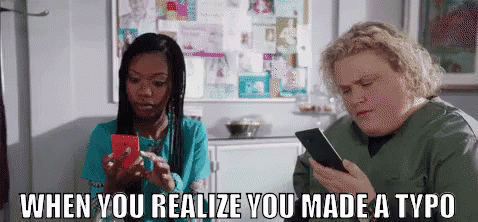

Hello world

Here I am. I finally decide to open a blog. I do so with a bit of apprehensiveness but ambitions too.
Let me explain.

I read a lot on the internet. With my [RSS reader](https://en.wikipedia.org/wiki/RSS) I try to stay out of socials bubble prisons. 
I'm aware I'm only creating another one of my own, but this way I have the pretense of owning it myself instead of an algorithm
built to help somebody else making money on my behalf. Ny constantly profiting of others precious work I find everywhere
on the internet, I thought to my self I could try to contribute.

As a tech, I will probably cover more this field of expertise more than the rest. I'm not sure I will be able to produce
quality content or event if it will be useful. Let's try and see.

Opening a blog is a rather old idea in my head, but I always had a final frontier I could not go over to make it real.

### Spelling, grammar,... !!

People knowing me knows it, I'm unable to write with no errors in each and every word.
Event after careful proofreading, Spelling and grammar stays mysteries to me. As it was not enough, I also make a lots
of typo typing, and it's really hard for me to spot them. My past and present colleagues knows what I mean.

This issue it the same in my mother tong, French, and English.

Being incapacitated like that always prevent me going forward in public writing other than a few tweets. If you are reading
those lines, it mean I went over my fears. I don't know how long it'll last, A lot I hope.

I'm convinced form should not block access to substance. Only the meaning of a text should matter. Obviously there are 
limits where bother are intertwined, but as long as the original meaning is successfully transmitted it's ok.

I do not wish to deliver messages in a box broken by choice, but do my best to craft a beautiful enough box around my
messages. I'm not an artist, I acknowledge some may not like my imperfect boxes. Too bade for them, but I have to play the game
by the rule, I have no choice.

I'm completely open to criticism (with all my bias 😉, I can react badly sometimes). However, for all comment about form,
spelling, grammar, typos I will have only one answer:

> Spelling, grammar, typo errors on each word ? I'm deeply sorry for that. Help me fix it.
> At the bottom of each page a Github link is available. You can follow it to suggest corrections.
> It'll be my pleasure to integrate it as long as it does not change the meaning of my message.
> (Your name (from Github) may appear on the Post page as writing corrector)

I know internet is a ruthless jungle, let's hope bad lions stays in their idea's desert.

Who knows, maybe it will help me improve myself.🤷

### Substance

I don't know if I will be able to produce enough content or event if it will have enough quality to be useful.
I don't know what I will publish exactly, but I want to start by this kind of things:
 - Share links and reading I found useful or interesting
 - Share my opinion on music, fils, games, anything
 - A bit of political point of view
 - Technical tutorials
 
#### www.mylife.com
My opinions and preferences will be obviously purely personal. 
Why share my opinion on a blog ? will you ask. Why not ? 

Also, for me, big platforms should not be the only one to control advices, opinions and reviews

For example, today Amazon is almost a mandatory place to get review on "things". Even I give too many credits to the 
yellow stars of the website, and their corresponding reviews.
Steam concentrate most of the Video games reviews, Imdb for movies, Youtube also for movies, game, music, lifestyle, ...

Af course there is specialized website doing a wonderful job.

Basically, everything that is hosted on a big platform is available to us on the conditions it makes money to the platform
it's on, it does not go against sacred TOS. As I already contributes enough to them, I wish to contribute to the free
internet.

I will write in English and / or in French. I may translate some posts. I do not wish tha impose rules on me on this
regard but on any request I will be happy to translate.

#### Tech

As a developer, internet is my first technical information source. I spend my personal and professional life on blogs, 
websites, and stackoverflow of course. I often find what I need, but rather often than never, I have to combine multiple
sources to get to the result I want. 

I do not know  I will have always enough courage and time, but I wish to contribute by giving my take of the story.

I said "tutorials", but I think it will take a lot of different forms. Sometimes real tutorials, sometimes simple pages
with what I find relevant information, what made me walk to the solution. I might even publish selfish posts to help my 
futur self. I would be funny to find my blog during a search 😂

I'm an unspecialized "tech" and like a lots of technologies and stuffs, here an incomplete list I think I will talk about.

 - Linux / Windows (Gaming is still a Windows thing 😭)
 - Développement Backend
    - PHP (Nut I think everything has already been told)
    - Go
    - GraphQL
    - TypeScript
 - System administration (As a dev, not a real sysadmin)
    - Kubernetes
    - Proxmox
    - Raspbery Pi & Arduino
    
Technical posts will be in english most of the time, and it is unlikely I will translate them without some one asking me
specifically.
 
#### Quicks

I also with to use this blog as a relay to my social media shares. 
I'm on [Twitter - @ztec6](https://twitter.com/ztec6/) and [Mastodon - @ztec@mamot.fr](https://mamot.fr/web/accounts/23814) (well, twitter mostly)

When I wish to comment an article I read I will publish it on the blog as a Quick. They will not be visible except via
their tags.

Quicks will be published to Twitter, and maybe Mamot too. I "Just" need to write a script that do that automatically. 
I'm too lazy to do it manually.

I'll be like public bookmarks.Like [Shaarli](https://github.com/shaarli/Shaarli) for those who knows. 

### The blog

I built this blog simply. No php, no devs to make it run. I used a static site generator called  [Hugo](https://gohugo.io/).

Sources are available on Github: [https://github.com/ztec/blog/](https://github.com/ztec/blog/)

I used the default hugo theme to build my onw. I'm not 100% satisfied of the result, and the blog's visual will 
definitely evolve a lot in futur.

Message to actual CSS developers :

> NO NOT LOOK AT HTML CODE 🙏

#### Accessibility

Even if I did not performed thorough tests, accessibility was important during the design.
For example, contrast, font size, and [screen reader](https://en.wikipedia.org/wiki/Screen_reader) compatibility try to be good or best it can be. 
I will probably write a blog post about that when I feel I reached the quality standard I have.

As I do not have reading disability, I'm not in position to evaluate accessibility for real. I would be really happy if someone,
one day, give me feedbacks on this matter. Good, or manyly bad. If some thing is not accessible, it **must** become accessible, and I will to do my best for that.
   
#### Hosting

This blog is hosted on a server on top of my fridge. Probability I host it somewhere else is high. 
In the meantime, it may be offline from time to time. I do not wish to put pressure on me about it's availability.
My server availability is high enough for me right now.

### Conclusion

This post is way longer than I anticipated first. Predominately after translating it 🤣. 
It helped me a lot clarifying my motivations and what I plan. Obviously, the futur is an known place, for now, and a lot
will change. I want this blog to be alive and a good representation of myself. It will evolve with me, I hope.

Thanks reading me,\
[Bisoux](/page/bisoux) 😗

