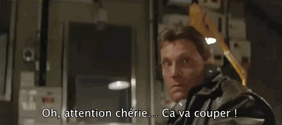

Bonjour le monde

Bon voilà. Je me décide enfin à ouvrir un blog. C'est avec une certaine appréhension que je démarre, mais aussi beaucoup 
d'ambitions.
Je vous explique tout ça.

Je lis beaucoup sur internet. Avec mon [lecteur de flux RSS](https://fr.wikipedia.org/wiki/RSS) j'essaie de limiter les bulles sociales. Bon je sais 
que je ne fais qu'en recréer une autre, mais je me dis qu'au moins c'est moi qui décide et pas un algorithme 
conçu pour faire gagner de l'argent à quelqu'un. À force de profiter de tous ces précieux contenue que je trouve 
partout sur internet je me suis dit que je pourrais essayer d'y contribuer. 

En tant que Tech, c'est surement dans ce domaine que je pourrais contribuer le plus je pense. Cependant je ne sais pas 
si j'arriverais à produire de la qualité, ou si ça sera utile. Je tente et on verra. 

Cette idée d'ouvrir un blog est dans ma tête depuis longtemps mais je me heurte à un gros mur quand je veux le faire pour
de vrais. 

### L'orthographe !!

Ceux qui me connaissent le savent, je ne suis pas capable d'écrire sans faire une faute à chaque mot. Même après relecture
les mystères de l'orthographe, la grammaire, la conjugaison, etc. me reste impénétrable. Et comme si ça suffisait pas
je fais beaucoup de typos en tapant et je n'arrive pas souvent a les repérer. Mes collègues (passé et présent) savent
de quoi je parle. 

Cette incapacité créait un blocage impossible à franchir pour moi. Si vous lisez ces ligne, c'est que j'ai réussi à passer
outre. Je ne sais pas pour combien de temps cependant. Espérons beaucoup.

Mes convictions sont que la forme ne devrait jamais être prise en compte mais seulement le message. Évidement il y a des
limites, mais tant que le message est transmis, je pense qu'on est dans le domaine de l'acceptable. 

Mon souhait n'est pas de livrer un message dans une boite volontairement cassée mais plus de faire de mon mieux pour
faire une belle boite autour de mon message. N'étant pas un artist, je comprendrais que des gens n'aime pas mes boites.
Ça serait dommage mais c'est le jeu, tans pis. 

Je suis totalement ouvert à la critique (avec tous mes biais hein, je peux aussi prendre mal une remarque à chaud). 
Cependant je ne répondrais aux remarques et commentaire qui concerne la forme et l'orthographe qu'une chose :

> Il y a une faute à chaque mot ? J'en suis désolé. Aidez-moi à corriger cela.
> En bas de chaque page, il y a un lien vers Github. Vous pourrez y proposer une correction.
> Je me ferais un plaisir de l'intégrer tant que j'estime qu'elle ne change pas le sens de mon message.
> NB: Votre nom (depuis github) pourrais apparaitre sur l'article en tant que correcteur

Je sais qu'internet est une jungle impitoyable, espérons que les méchant lions resteront dans leur désert d'idées. 

Et qui sait, peut-être que ça m'aidera à m'améliorer 🤷

#### Écriture inclusive

Je suis en faveur de l'utilisation de l'écriture inclusive. Beaucoup d'endroits s'y prêtent, et ce blog aussi. Cependant
je ne me sent pas capable de gérer l'écriture inclusive en plus de tout ce que j'ai indiqué dans le paragraphe précédent.

Pas d'écriture inclusive, j'écrirais tout au masculin, car je suis un homme et que c'est plus simple pour moi. 
Je pense cependant que je réviserais ce sujet un jour. En tout cas j'aimerais bien.

Bien que j'écrive au masculin, je tâcherais d'inclure les femmes dans mes écrits. Par exemple, si je parle de métier, 
je citerais les deux versions. J'utiliserais des formes neutre, ou j'expliciterais "les hommes et les femmes".

Si vous pensez que j'ai raté une occasion de visibiliser les femmes, 
ou [LGBTQIA+](https://fr.wikipedia.org/wiki/Lesbiennes,_gays,_bisexuels_et_transgenres) un commentaire et hop ça sera corrigé.

### Le fond

Je ne sais pas si je pourrais produire suffisamment de contenu ou même s'il sera suffisamment de qualité, ou simplement utile.
Je ne sais pas trop ce que je vais publier non plus, mais j'ai envie de commencer par ce genre de choses :
 - Partager des liens et lectures utiles
 - Partager des avis sur de la musique, des films, des jeux … n'importe quoi
 - Un peu de politique peut être
 - Des tutoriels techniques
 
#### 3615 mylife
Tout ce qui concerne mes avis, ~~mon oeuvre, mes mémoires~~, ça sera du pur personnel. 
Pourquoi donner mon avis sur un blog ? me demanderez-vous. Pourquoi pas ?

Aussi, les grandes plateformes ne devrais pas avoir le monopole des retours, analyse, et avis des gens selon moi. 

Par exemple, Amazon à aujourd'hui le presque monopole des avis sur les "Choses". Moi même j'attache beaucoup d'importance
aux étoiles jaunes du site, et les avis correspondant.
Steam c'est les avis sur les jeux vidéos ; Imdb le cinéma ; Youtube le cinéma, les jeux vidéo, la musique, le style de vie …

Il ya a heureusement des sites spécialisés et des associations de consommateur qui font un travail remarquable.

En gros, tout contenu hébergé sur une plateforme est disponible tant qu'il rapporte de l'argent à la plateforme, 
et qu'il ne la dérange pas. Contribuant volontairement a leur enrichissement, je souhaite contribuer à l'internet 
libre (de pensée, de diffusion, d'argent).

J'écrirais en anglais et / ou en français. Il est probable que je traduise certains articles. Je ne m'impose aucune règle
cependant. À la moindre demande, je me ferais un plaisir de traduire.

#### De la technique

En tant que développeur, internet est ma source d'information technique numéro uno. Je passe ma vie perso et professionnelle
sur des blogs, des sites divers et bien évidement stack-overflow. Je trouve souvent mon bonheur, mais souvent c'est en 
combinant plusieurs sources que j'arrive à obtenir le résultat que je souhaitait.

Je ne sais pas si j'aurais souvent le courage et le temps, mais j'aimerais contribuer en proposant justement un article
résumant mes recherches.

J'ai dit "Tuto", mais je pense que ça prendra plein de forme. Parfois des tutoriels pas à pas, parfois des pages simples
avec quelques lignes contenant l'information qui m'a fait avancer. Parfois je posterais des articles purement égoïstement
pour aider mon moi du futur. Ca me ferais drôle de tomber sur mon blog au détour d'une recherche 😂

Je suis un "tech" touche a tout, mais voici une petite liste non exhaustive des domaines que je pense aborder.

 - Linux / Windows (bien obligé pour jouer 😭)
 - Développement Backend
    - PHP (mais je pense que tout a été déjà dit)
    - Go
    - GraphQL
    - TypeScript
 - Administration système (c'est un peu pompeux mais j'ai rien de mieux sous la main. Je susi qu'un dev)
    - Kubernetes
    - Proxmox
    - Raspbery Pi & Arduino
    
Bien souvent, les articles techniques serons en anglais et il est peu probable que je fasse des traductions, à moins qu'on
 me le demande spécifiquement.
 
#### Quicks

Je compte aussi utiliser ce blog comme relai de mes partages dans les réseaux sociaux. Je suis présent sur [Twitter - @ztec6](twitter.com/ztec6/)
et [Mastodon - @ztec@mamot.fr](https://mamot.fr/web/accounts/23814). Bon, surtout Twitter. 

Quand je souhaiterais partager un article, un blog, n'importe quoi, et potentiellement écrire une courte réaction je 
la posterais sur le blog sous forme de Quick. Ils ne seront pas visibles excepté via leur tags s'ils en ont.

Les quick serons alors publié sur Twitter, et pourquoi pas sur Mamot aussi. Il faut que je me bouge pour écrire
le bout de code qui fera la publication automatiquement car je suis trop flemmard pour le faire à la main.

Ça sera comme mes bookmark publiques.

Pour ceux qui connaissent, c'est un peu le principe de [Shaarli](https://github.com/shaarli/Shaarli)

### Le site

J'ai construit ce blog assez simplement. Pas de php, ni de development pour le faire tourner. J'ai utilisé un 
générateur de site statique qui s'appelle [Hugo](https://gohugo.io/).

Les sources sont disponibles sur github : [https://github.com/ztec/blog/](https://github.com/ztec/blog/)

Je suis parti du theme utilisé dans la doc pour faire le mien. Je ne suis pas 100% satisfait du résultat et
l'apparence de ce blog risque de beaucoup changer dans le temps.

Message à l'attention des développeurs qui savent vraiment faire du CSS:

> Ne regardez pas le code HTML 🙏

#### Accessibilité
Bien que je n'ai pas encore testé en profondeur, j'ai attaché beaucoup d'importance à l'accessibilité. Cela se retrouve
dans les contrastes des couleurs choisi, la taille des caractères du contenu important, et l'accessibilité au [lecteur d'écran](https://fr.wikipedia.org/wiki/Lecteur_d%27%C3%A9cran).
Je ferais surement un article à ce sujet quand j'aurais atteint un niveau satisfaisant de qualité à cet égard.

Comme je ne suis pas en situation d’handicap, je ne suis donc pas en mesure de valider pour de vrai cette accessibilité. 
Je serais heureux si quelqu'un, un jour, me fait des commentaires à ce sujet. Positifs, mais surtout négatifs. Ce qui n'est
 pas accessible **doit** le devenir et je veux faire de mon mieux pour ça.
   
#### Hébergement

Ce blog est hébergé sur un serveur qui est sur mon frigo. Il est fort probable qu'il bouge de là (le site, pas le serveur, ni le frigo).
En attendant, ça risque de couper de temps en temps chéri. 

### Conclusion

Ce post est bien plus long que je ne le pensais au départ. Il m'a beaucoup aidé à clarifier mes motivations et ce que 
je prévois. Évidemment, l'avenir m'est inconnu, pour le moment, et beaucoup de chose changeront surement. 
Je veux que ce blog soit vivant et me représente. Il évoluera avec moi, j'espère. 

Merci infiniment de m'avoir lu,\
[Bisoux](/page/bisoux) 😗

