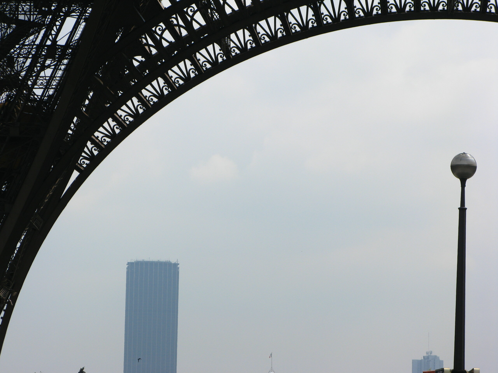

J'aime Paris. Depuis toujours, d'aussi loin que je me souvienne. 
J'ai eu la chance d'y faire quelques années d'études, et maintenant d'y vivre. 
J'habite dans le quartier Gambetta. C'est facile à trouver sur une carte, regardez à l'Est le gros carré de verdure, 
le [Cimetière du Père-Lachaise](https://fr.wikipedia.org/wiki/Cimeti%C3%A8re_du_P%C3%A8re-Lachaise). 
Gambetta est juste au-dessus en haut à droite.

Dans les parages, il y a des monuments que j'ai croisés un millier de fois, notamment en voiture en revenant du périphérique:

")
")
)")
")

---

Ce quartier est très ... animé. De jour comme de nuit. C'est pas non plus la rue Oberkampf bien heureusement. 
Rendez-vous le jour de la fête de la music, c'est toujours animé. Le samedi en été vous aurez peut-être la chance
d'entendre la fanfare (ou le "bonheur" d'etre réveillé aux sons des trompettes)

---

J'habite là depuis 7 ans maintenant. Pendant tout ce temps, je n'ais pas bien "visité" mon quartier. 
Il y a bien quelques endroits que j'ai découverts ici et là, mais je n'ai jamais vraiment pris 
le temps de sortir des 2-3 rue où se trouvent mes commerces de proximités. 

Depuis quelques semaines, j'ai donc décidé de me perdre dans Paris, et plus récemment je me suis volontairement perdu près
de chez moi. L'oeil ouvert j'ai tenté observer la beauté de cette ville. Entre le street art, 
les rue typiquement parisienne, les bancs cassés et les rues bucoliques je pense qu'on peut tous la voir cette beauté…

")
")

")

Quels découvertes ! Je ne m'attendais pas à trouver autant de lieux aussi bucoliques et complètement deconnecté de l'image
habituel de Paris.

---

J'ai évidement croiser quelques œuvres insolites

")

---

Paris ne serait pas Paris sans quelques monuments de renommée mondial.

")**
")
")

")

---

Depuis que j'évolue dans Paris je suis souvent bien trop occupé pour le regarder. Parfois, cependant, j'ouvre l'oeil
et je prends des clichés du Paris que je trouve beau. Donc, en vrac, quelques photos que j'ai retrouvé dans mes archives.
La plus ancienne retrouvée date de 2008, probablement quand j'ai commencé la photographie en amateur, avec un argentique
et des pellicules. À l'ancienne! Saurez-vous les retrouver ?

---

J'aime Paris. Cette ville est aussi insupportable que je l'aime. Le bruit des klaxons, des sirènes, des gens
un peu fou ou simplement ivres la nuit. Mais aussi, les oiseaux, architecture et surtout l'Art. Il y en a partout.
Si vous regardez bien, les rues sont remplies de petites et grandes œuvres; De statue commemorative chargée d'histoire;
De lieux insolites; De gens insolites et parfois impolis; De touriste qui vous ferons perdre votre patience;

De Paris vous pouvez aller où vous voulez, souvent en restant intra-muros. Je suis heureux d'y vivre
et, à ma façon, d'y contribuer. Je souhaiterais que plus de gens aient cette chance, que Paris ne soit plus réservé
à ceux qui en ont les moyens, ou ceux qui ont plus de plis sur le visage que d'années d'experience de la vie.

Un jour, mes sentiments changerons peut-être, d'ici là Paris est magnifique.

---

Vous retrouverez quelques une de ces photos, et bien plus dans mon album Paris sur Flickr à l'adresse suivante : https://www.flickr.com/photos/ztec/albums/72177720295387877

Merci infiniment de m'avoir lu,\
[Bisoux](/page/bisoux) 😗