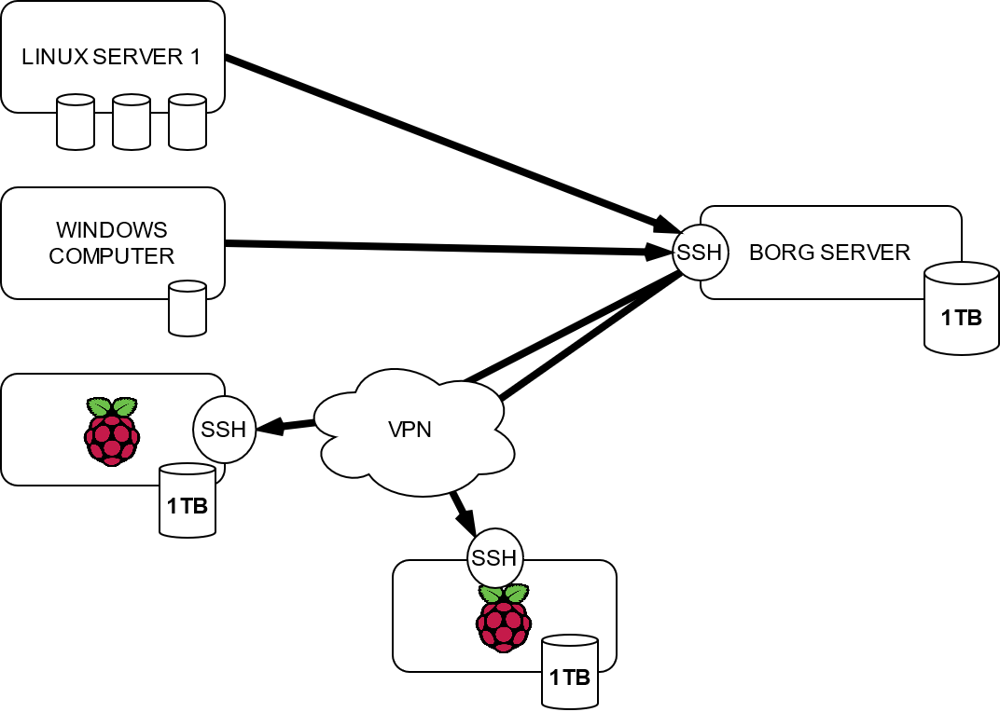
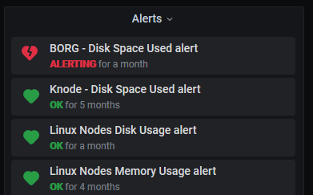
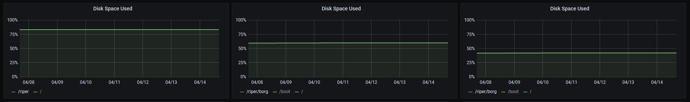
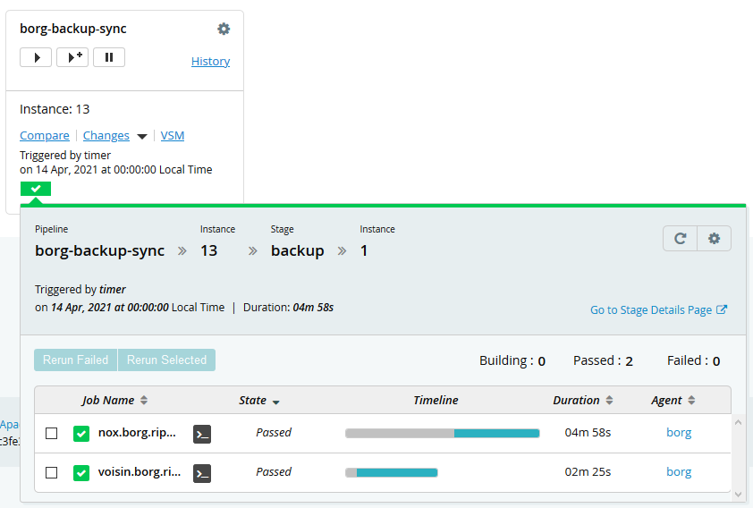

Vous avez surement entendu parler de [l'incendie d'un datacenter d'OVH à Strasbourg](https://twitter.com/olesovhcom/status/1369478732247932929). Il a remis les pendule de beaucoup
de monde a l'heure. En effet, beaucoup de sites on été coupé quand leurs serveurs ont tout simplement brulé. Si certains
on réussi à remettre en ligne leur site et service, voir même n'avoir aucune interruption pendant l'incident, on en a 
vus qui on mit beaucoup plus de temps. [Certain on même tout perdu](https://twitter.com/playrust/status/1369611688539009025), rien n'a survécu.

Ne pas subir interruption ou être capable de remonter son service en quelques heure c'est souvent une question de
"haute disponibilité". Je ne vais pas parler de ça aujourd’hui. 

Aujourd'hui, je vais parler Backup, et expliquer un peu comment je sauvegarde mes données importantes.

## La base
Dans le monde du backup, on dit souvent qu'il y a 3 règles à respecter

- avoir 3 copies
- utiliser au moins deux supports de stockage différents
- La troisième copie géographiquement ailleurs (pas là où sont les deux premières donc)

Le point le plus important, et souvent mis de coté, c'est le 3ᵉ. Si tous 
vos backup sont chez vous et sont tous volé ou détruit, ils ne seront pas très utiles.

Le cloud est une bonne solution pour avoir une 3ᵉ endroit, mais j'ai décidé de m'en passer pour des raisons de couts, 
de principe et d'apprentissage.

## Borg

[Borg](https://www.borgbackup.org/) est un outil en ligne de commande qui permet de faire de la sauvegarde incrémentale.
Cela veut dire qu'il peut sauvegarder juste les nouveautés depuis un précédent point de sauvegarde. Il a aussi un système de 
déduplication qui lui permet de réduire la taille des archives de sauvegarde s'il détecte plusieurs fois le même fichier.

Il fonctionne sous linux, mais j'ai réussi à parfaitement l'utiliser sous windows grâce au [sous système linux](https://docs.microsoft.com/en-us/windows/wsl/install-manual).

Son pricipe est simple, en une commande il scanne un répertoire et copie son contenu dans une archive borg via une connection
ssh. Par exemple :

```bash
borg create -s locutus@host:/path/borg/backup/repo/$REPO_NAME::$ARCHIVE_NAME-$CURRENT_DATE  /path/to/backup
```

Ce qui fini par donner ce genre de sortie

```bash
------------------------------------------------------------------------------
Archive name: mirror-2021-04-13-13h57
Archive fingerprint: c2f6ffa259f358636371439767dd9edc571ec01d84aa474c052c555b70b5c76f
Time (start): Tue, 2021-04-13 13:59:22
Time (end):   Tue, 2021-04-13 13:59:27
Duration: 4.67 seconds
Number of files: 0
Utilization of max. archive size: 0%
------------------------------------------------------------------------------
                       Original size      Compressed size    Deduplicated size
This archive:                  712 B                640 B                640 B
All archives:                2.77 TB              2.79 TB            137.29 GB

                       Unique chunks         Total chunks
Chunk index:                   53243              1224153
------------------------------------------------------------------------------
```

Je vous invite à lire la [doc de borg](https://borgbackup.readthedocs.io/en/stable/) pour les détails concernant la création d'un repo borg.
Il y a plein de façon de le faire, je ne rentrerais pas dans les détails.


### Vue global

En gros, voici comment j'ai construit mes backup.



##### Borg server 
Un serveur est dédié a la réception des backup borg. En réalité c'est une Machine virtuel, mais cela pourrais très bien 
être un raspberry pi aussi. L'élément important, c'est qu'il possède un disque dure de taille suffisante pour réceptionner 
ensemble de mes backup. 

J'ai reservé 1TB sur des disques en [RAID 5](https://fr.wikipedia.org/wiki/RAID_(informatique)#RAID_5_:_volume_agr%C3%A9g%C3%A9_par_bandes_%C3%A0_parit%C3%A9_r%C3%A9partie)
Si je doit sauvgarder plus, je vais soit devoir racheter des disques, soit faire du ménage dans les archives.

Il est à noté que les backup sont incrémental et conservent les historiques des fichiers. Un fichier supprimé à la source
ne le sera pas dans les archives. Pas avant une période assez longue (qui se configure).

Dans un répertoire j'ai créé un dépot borg par machine que je souhaite sauvegarder.

```bash
root@borg:/backup# ls -la
total 40
drwxrwx--- 10 locutus locutus 4096 Nov  8 01:57 .
drwxr-xr-x  4 root    root    4096 Jun 19  2020 ..
drwxrwx---  3 locutus locutus 4096 Jul 24  2020 windows
drwxrwx---  3 locutus locutus 4096 Nov 19 00:44 home
drwxrwx---  3 locutus locutus 4096 Apr 14 06:18 knode01
drwxrwx---  3 locutus locutus 4096 Apr 14 06:18 knode02
drwxrwx---  3 locutus locutus 4096 Jun 20  2020 martine
drwxrwx---  3 locutus locutus 4096 Nov  8 01:52 pouet
drwxrwx---  3 locutus locutus 4096 Apr 13 00:58 pouet-home
drwxrwx---  3 locutus locutus 4096 Nov  8 01:53 pouet-home-old
```

L'ensemble des données de backup sont accessible par un utilisateur dédié nommé `locutus`. C'est l'utilisateur ssh
que les serveur et ordinateur utiliserons pour faire les sauvegarde.

Les dépots sont chiffré et utilisent tous une clé différente que seul la machine à sauvegarder (et moi-même connaissons).

##### Linux server

Sur chaque VM que je souhaite sauvegarder un script permet de créer une archive du repertoire que je souhaite sauvegarder.

```bash
#!/bin/bash
source /root/.bashrc
ARCHIVE_NAME="kube"
CURRENT_DATE=$(date +"%Y-%m-%d-%Hh%M")
echo "Creating a backup archive of /riper/kube named '$ARCHIVE_NAME-$CURRENT_DATE'"
borg create \
 --checkpoint-interval 600 \
 --exclude-caches\
 --verbose \
 -p \
 -s ::$ARCHIVE_NAME-$CURRENT_DATE \
 /riper/kube && \
borg prune -v --list --keep-within=10d --keep-weekly=4 --keep-monthly=12 --keep-yearly=-1
```

Configuré ainsi via un [CRON](https://fr.wikipedia.org/wiki/Cron)
```bash
18 6 * * * /root/borg-backup-volumes >> /var/log/backup-kube 2>&1
```

Dans le `.bashrc` de root, il y a des variable d'environment qui contiennent les secret et emplacements de sauvegarde.
Il faut bien penser a le sécurisé pouet que seul root puisse y accéder.

```bash
BORG_OPTS=""
BORG_SERVER="ssh://locutus@norghost"
BORG_REPO_PATH="/backup/knode01"
export BORG_REPO="$BORG_SERVER$BORG_REPO_PATH"
export BORG_PASSPHRASE="redacted"
```

La dernière ligne du script permet de configurer combien de temps on souhaite conserver les fichiers
supprimé.

```bash
borg prune -v --list --keep-within=10d --keep-weekly=4 --keep-monthly=12 --keep-yearly=-1
```
 - Toutes les archives sont conservées pendant 10 jours (une par jour via le CRON)
 - Au dela seul 4 sont conservé par semaine pendant 1 mois
 - Au dela seul 12 sont conservé par mois
 - Au dela d'un an, tout conservé. 

On voit qu'il y a un soucis, je risque de manquer de place après quelques années si je ne change pas le dernier paramètre. 
j'attends d'en avoir besoin pour tester différentes valeurs, `-1` indiquant, `tout conserver`

##### Windows server

Sous windows, je n'ai pas encore de cron de configuré, mais j'ai fait des sauvegardes ponctuelles en exécutant la commande à la main.

[Une fois Debian installé en tant que sous système linux](https://docs.microsoft.com/en-us/windows/wsl/install-manual), la démarche est rigoureusement identique à linux. Via les points
de montage de Windows, on peut donc sauvegarder les disques et répertoires qu'on souhaite, 

Par example, Je sauvegarde mes photos personne via cette commande

```bash
ARCHIVE_NAME="Photos"
CURRENT_DATE=$(date +"%Y-%m-%d-%Hh%M")
echo "Creating a backup archive of /mnt/s/photos named '$ARCHIVE_NAME-$CURRENT_DATE'"
borg create \
 --checkpoint-interval 600 \
 --exclude-caches\
 --verbose \
 -p \
 -s ::$ARCHIVE_NAME-$CURRENT_DATE \
 /mnt/s/photos && \
borg prune -v --list --keep-within=10d --keep-weekly=4 --keep-monthly=12 --keep-yearly=-1
```

##### Les raspberry PI

Comme je l'ai dit au début de l'article, il faut au moins 3 copie, dont une ailleurs. Pour le moment j'ai

 - Une copie originale
 - Une copie sur le serveur BORG

Les deux sont physiquement au même endroit, chez moi. J'ai donc décidé d'utiliser des Raspberry PI pour faire 
des copies supplémentaires. J'en ai pris deux (raspberry pi 3).

Dessus, j'ai installé un raspbian classique et j'ai configuré un VPN. Ce VPN est dédié au backup de sorte 
que seul les resources utiles pour le backup sont accessible une foi connectée. J'ai utilisé OpenVPN. Je ferais surement
un article dessus plus tard.

Chaque raspbery PI est associé avec un disque dur USB de taille au moins égale à la capacité du serveur BORG.

Grace au VPN, je peux placer ce raspberry pi avec son disque dur n'importe où avec un accès internet.

###### borg archive in borg archive

Ma première idée a été de configurer un script qui `rsync` les archive borg sur chaque raspberry pi. Mais attention, 
si jamais je détruis complètement les archives sur borg-serveur (volontairement ou non), je risque de répliquer mes erreurs et perdre les autres
copies.

Je fait donc un backup borg sur les raspbery pi. Pour chaque dépot, j'ai créé un dépot identique sur chaque raspberry pi
dans lequel je backup le répo sur le serveur borg.

De cette façon je conserve les fonctionnalités de borg avec plusieurs versions de mes archives. 
La fonctionnalité de déduplication de borg fait qu'il y a très peu de perte de place car les objets dans les archives 
borg son quasiment immutable.

 - Mes serveurs créent des archives sur le server borg via ssh
 - Le serveur borg crée des archives de ses archives sur les raspberry pi via ssh en passant par le VPN
 - Les depots borg sur les raspberry pi ne sont pas chiffré (les originaux le sont déjà)

J'ai configuré un cron pour faire ces copies automatiquement

```bash
57 13 * * * /home/locutus/borg/mirror-borg.sh IP-RASPBERRY-PI-1 >> /var/log/borg/IP-RASPBERRY-PI-1 2>&1
57 13 * * * /home/locutus/borg/mirror-borg.sh IP-RASPBERRY-PI-2 >> /var/log/borg/IP-RASPBERRY-PI-2 2>&1
```

```bash
#!/bin/bash
export BORG_UNKNOWN_UNENCRYPTED_REPO_ACCESS_IS_OK="yes"
if [ $# -eq 0 ]
  then
    echo "No arguments supplied, please specify hostname to mirror to"
fi

TARGET=$1
echo "Create repository if they does not exist"
ls -l /backup/ | awk '{print $9}'|tail -n +2  | xargs -I {} -n 1 /usr/local/bin/borg init --encryption=none locutus@$TARGET:/backup/{}

LIST=$(ls -l /backup/ | awk '{print $9}'|tail -n +2)

ARCHIVE_NAME="mirror"
CURRENT_DATE=$(date +"%Y-%m-%d-%Hh%M")
declare -a arrayList
while read -r line
do
    arrayList+=("$line")
done <<< "$LIST"

for REPO_NAME in "${arrayList[@]}"
do
  echo "Creating a backup archive of $REPO_NAME named '$ARCHIVE_NAME-$CURRENT_DATE'"
  /usr/local/bin/borg create \
   --checkpoint-interval 600 \
   --exclude-caches\
   --verbose \
   -p -x \
   -s locutus@$TARGET:/backup/$REPO_NAME::$ARCHIVE_NAME-$CURRENT_DATE \
   /backup/$REPO_NAME
done <<< "$LIST"
```

Je me retrouve avec deux raspberry pi qui contiennent une copie de mes archives borg avec 1 jour de décalage. 
J'en garde un chez moi, ça créer un second support de stockage,
J'en ai mis un chez un membre de ma famille qui à la fibre, ce qui me fait une copie ailleurs à un cout relativement faible.

Un raspberry pi ne consomme pas beaucoup d'énergie, et pourrais même est modifié pour se réveiller une fois par jours juste pour 
faire le backup et se coupé. Le plus gros du budget se trouve être le ou les disques dur usb. 

## Monitoring

C'est bien d'avoir des backup automatique, mais encore faut-il qu'ils fonctionnent et ne tombent pas en panne. Le mieux 
c'est d'être averti quand un truc tourne pas rond. 

Quand un cron se termine en erreur, un mail d'alerte est suffisant.

L'espace disque est suivis avec [prométheus](https://prometheus.io/) dans mon cas. D'ailleur, je doit résoudre celle qui est actuellement levé



L'espace disque de mes backup ne bouge pas énormément, voici 14 jours d'historique respectivement sur le serveur borg et les deux raspberry pi (les disques des raspberry sont de 1.7Tb et 2.6TB contre 1TB pour le serveur borg).



Depuis peu, j'ai même déplacer le cron de syncronisation des raspberry pi sur [GoCD](https://www.gocd.org/) pour tester.



## Conclusions

J'utilise ce système depuis moins d'un an, et il y a plein de détails qui ne sont pas parfait, cependant :

 - C'est pas chère comparé à des solutions cloud, surtout quand on parle de backup de 1TB ou plus;
 - C'est complètement basé sur du logiciel libre;
 - Borg permet de parcourir n'importe quel archive facilement, ce qui m'a permis de retrouver des vielles version de fichier aisément;
 - C'est relativement sécurisé pour mon usage;
 - c'est automatique, je n'ai rien à faire, ça tourne tout seul une fois en place;
 - Il faut du bon monitoring sur les cron et l'éspace disque cependant, pour pas se rendre compte trop tard qu'un cron ne marche plus par exemple.


Merci infiniment de m'avoir lu,\
[Bisoux](/page/bisoux) 😗


