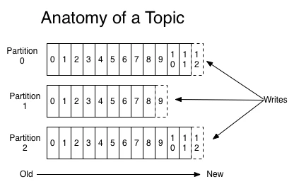
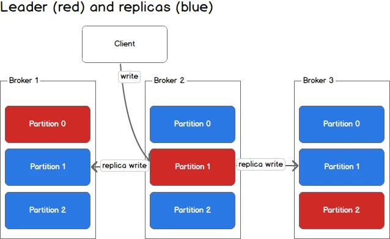



You are a developer, and you heard of Apache [Kafka](https://en.wikipedia.org/wiki/Franz_Kafka), the message broker, and you find it probably complex and difficult to work with.
Today, I will try to give you the basic knowledge about kafka you need to know to be able to work with it on a daily basis.

This page is what I compiled over the years as my simplified view of Kafka and I often use it to explain Kafka to my pairs.

This Post contains lots of content from already great articles written by others. If you want to refer to the original materials, you can skip
to the end and watch the "source" section. I've put them all.

## Basic knowledge about Kafka

In order to correctly use Kafka as a developer, you must know and understand a bit about how it works **externally** AND **internally**.

Remember that this post is simplified and skip some details to make things simpler.
If you have a doubt about a detail, you can check the official documentation which is clear and exhaustive: [https://kafka.apache.org/documentation/](https://kafka.apache.org/documentation/)

## What is Kafka?

Kafka is a [message broker](https://en.wikipedia.org/wiki/Message_broker). Its goal is to receive messages and pass them as is to something else. Nothing more. It is also associated to "stream" processing as it can do it in real-time.

Kafka offers some guarantees about its job:

 - A message received by Kafka will be delivered **at least** once to each consumer group.
 - A message can be stored for a custom duration independently of consumers
 - A message can be secured at reception with configured replicas
 - Kafka is designed to be clustered, this mean scalable

## How Kafka works

Kafka is designed to be clustered. This mean its internal construction was created for this purpose.

The next two section describe what I will describe in this article. I strongly suggest you to read them once, then read them again 
after each section of this post. You should understand it completely once you've read the whole post. 

### Production of message:

The **Producer** sends **messages** into **topic** to one Kafka server of the cluster. Kafka find the **partition** associated to the message and sends it to the **partition leader's** Kafka server. 
The partition leader can either:
 - store locally the message, acknowledge back, then send the message to all replica servers
 - store locally the message, send it to all partition replica then wait for all replica servers to acknowledge then acknowledge back.

### Consumption of message:

**Consumer** connects to one **Kafka broker node** and registers itself as consumer of a topic with a **group.id**. 
The node return a list of nodes related to the topic the consumer is registered on. 
Kafka will trigger a **re-balance** process and **assign some partition to the consumer**. 
The consumer receives the list of partition assigned to it, and servers hosting them. 
It connects to all and starts consuming message. 

At some point, the consumer will record its advancement by **committing the offset** of the last processed message, for each partition assigned to it.

## Let's explain all

### Broker

A broker as a single node/server in the Kafka cluster. Broker is the word used to name nodes, nothing more.

### Producer

A producer "produces" messages and sends it to the Kafka cluster. The producer has two responsibilities:

 - Forge the payload, the content of the message
 - Define the topic where to send the message to
 - Optionally calculate the ID of the message according to specific rules. You should let kafka handle that for you.

Producer will connect to a broker of the cluster and send the message. Producer can vary broker acknowledgement requirements as such:

 - No acknowledgement (no response from server is expected). Fast but no guarantee
 - Leader acknowledgement (will wait for the partition leader to secure the message on its own local store) Still fast, but losing the partition leader = losing the data
 - Leader AND replica acknowledgement (will wait for the partition leader AND all replica to secure the message on their own local store). Slowest, but most secure 

### Consumer

A Consumer will "consume" message that Kafka assigned to it.

A consumer starts by connecting to a broker node and will receive back metadata about the cluster topology in order to connect to other nodes if required.

A consumer has one property **group.id** and can have metadata such as **client.id** (like user-agent).

### group.id 

The group.id is also called the **consumer group**.

Consumer with the same group.id will share message consumption. That mean that each partition of a topic will be assigned to one (and only one) consumer with the same group.id.

Consumer with different group.id will consume sames messages. That mean that you can have multiple consumers processing same messages at the same time. Each consumer's group will receive partition assignments.

### Consumer group

All consumers having the same group.id 

### Re-balance

When a partition leader unexpectedly die, the cluster will detect it and starts an election process to find a new leader. 
This means that producer & client will receive a **LeaderNotAvailable** message during the process and must handle this gracefully, meaning they must wait.

The election can take seconds to minutes to elect a new leader. (The delay is configured in kafka itself)

The process of stoping all consumer, and sometimes electing a new leader, then re-assigning partition ton consumers for them to resum their work, is called a **rebalance**.

The rebalance can happen in multiple situations, when
 - a partition leader die or become unavailable. (All consumers registered on the topic associated to the partition, whatever the group.id, receive a stop, and must wait)
 - a node is added or removed to the cluster. (same as above)
 - a consumer with a group.id register itself to consume message. (All consumers registered on the topic associated to the partition, and **same group.id** receive a stop and must wait)
 - a consumer with a group.id leave or is considered dead. (same as above)

The last two are important to consider. It imply that starting a new consumer on a topic with a group.id will stop the 
consumption process at this moment, and elections must be doe before all consumers with the group.id can resume.

### Message

A message in Kafka is composed of (among other things)

 - id
 - payload

Payload can be binary data or text. Message is agnostic of payload format. Payload can be small or big. The limit is manly 
fixed by the size of your disks, network connections, CPU available, and consumption delay you want.

Id is optional from producer point of view. If not provided, it will be a derivative of the payload hash. 

I strongly recommend to let Kafka generate it, moreover if your payload is rather small. 
Generating it will have impact on how scalable your usage of Kafka will be. If you wish to go this road, you must read the official documentation about how kafka decide
where messages go into partions

### Topic

A topic in Kafka is a logical place where you send message. Topics are split in partition according to a configuration (per topic).

It is usual to hear, "send those message to the playlist topic" or "Consume the topic playlist".

### Partition

Each topic is stored physically by partition. At minimum, a topic has 1 (one) partition, but can have much more.

When a message is received into a topic, a partition is selected and the message is stored inside. **The message will never be in another partition.**

### Partition replica

Each partition can be store in 1 (one) or more node for resilience. 
That means that the partition content will be synced between all replicas
when a message is received. This is how Kafka can guarantee you one message is received and not lost in the way. 
Multiple copies exist like a [RAID 1](https://simple.wikipedia.org/wiki/RAID#RAID_1_.22mirroring.22)

### Partition leader

When having multiple partitions, a single node will be elected as Partition leader. This means that at a time, it is the only server to contact for consuming/write message from/to the specific partition.

Partition leader can change when some events occurred. For example when a node is added/removed, or when partition configuration is changed.

### Offset

Each message in a partition has a "number" associated. Like "this is the first message, this is the second message, the 3rd, the 4th etc..."

Consumer will record process status on partition by committing offset, the number of the last message processed. 
Each consumer's group.id will have its own offset. They all consume the same messages, but does not process them at 
the same rate and need to record their progress independently.

The offset is a simple per-partition atomic counter. For example,

 - message 1 : counter = 4
 - message 2 : counter = 5
 - message 4 : counter = 7
 - …

By design, it has one implication: **Consumer must process message in order.** This is intended, as designed like they said.

Unlike other message broker (nsq, rabbitMQ), it is not possible to acknowledge a particular message. 
This is fundamental to understand because it will have a huge impact on retry/error strategies you will have to implements.

### Retention duration

Each partition will store messages for a given duration. This duration depend on needs and is configured on Kafka cluster. 
It can be global but also specific to topics.

### What about Zookeeper?

Zookeeper is the tool used by Kafka to maintain cluster coherence.
It is the single service that always knows the exact topology of the whole cluster. 
For example, during election of leaders, Zookeeper is the tool actually doing the election because he knows the status of each broker and can decide which one is eligible.

Zookeeper is also a clustered program, but this is for another day.

## How Kafka works
Now, let's get back to the beginning of the article.

### Production of message:

The **Producer** sends **messages** into **topic** to one Kafka server of the cluster. Kafka find the **partition** associated to the message and sends it to the **partition leader's** Kafka server.
The partition leader can either:
- store locally the message, acknowledge back, then send the message to all replica servers
- store locally the message, send it to all partition replica then wait for all replica servers to acknowledge then acknowledge back.

### Consumption of message:

**Consumer** connects to one **Kafka broker node** and registers itself as consumer of a topic with a **group.id**.
The node return a list of nodes related to the topic the consumer is registered on.
Kafka will trigger a **re-balance** process and **assign some partition to the consumer**.
The consumer receives the list of partition assigned to it, and servers hosting them.
It connects to all and starts consuming message.

## Conclusion & Personal notes

This page is not complete enough to understand all Apache Kafka aspect, and after some times you will probably have to
go deeper.
For that I suggest starting by the [official documentation](https://kafka.apache.org/documentation/), it is excellent.

Kafka is a wonder full tool to work with as long as you have excellent engineer to install and manage it.
I consider myself incapable of managing such complex software on a production environment. 
But as a "simple" user, it's wonderfully and performance are astonishing.

I professionally work with it as a simple message broker (same as RabitMQ or ZeroMQ). That's why I totaly skiped
the streaming aspect of Kafka, or all the glorious things it can do in a "Big data" or [Event sourcing](https://martinfowler.com/eaaDev/EventSourcing.html) context. 

Thanks reading me,\
[Bisoux](/page/bisoux) 😗

---

##### Sources:
 - https://sookocheff.com/post/kafka/kafka-in-a-nutshell/ 
   -  consumer-groups.png © Kevin Sookocheff
   -  data-log.png © Kevin Sookocheff
   -  log-anatomy.png © Kevin Sookocheff
   -  partitions.png © Kevin Sookocheff
   -  producing-to-partitions.png © Kevin Sookocheff
   -  producing-to-second-partition.png © Kevin Sookocheff
 - https://cwiki.apache.org/confluence/display/KAFKA/A+Guide+To+The+Kafka+Protocol
 - https://Kafka.apache.org/0102/documentation.html
 - https://Kafka.apache.org/documentation/
 - https://en.wikipedia.org/wiki/Apache_Kafka
   - OverviewApacheKafka.png By Ch.ko123 - Own work, CC BY 4.0, https://commons.wikimedia.org/w/index.php?curid=59871096
 - https://cwiki.apache.org/confluence/display/KAFKA/FAQ

