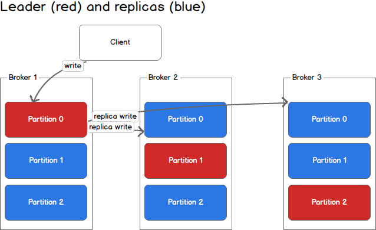
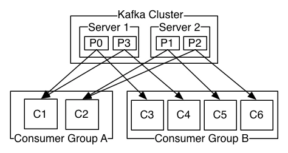
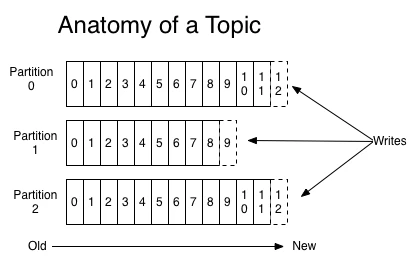
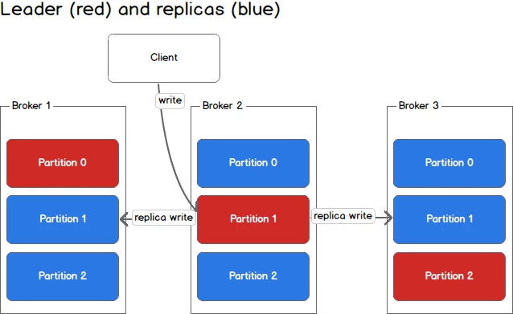
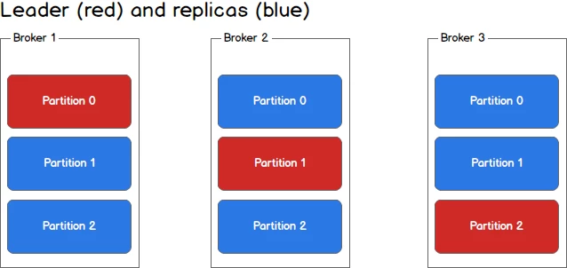
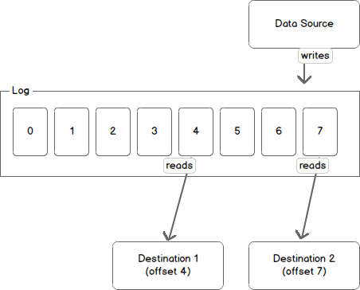



Vous êtes un développeur et vous avez entendu parler de Apache [Kafka](https://fr.wikipedia.org/wiki/Franz_Kafka), le broker de message. 
Vous trouvez que kafka est complexe et qu'il est difficile de l'utiliser.

Cette page contient ce que je considère comme le minimum vital pour comprendre et utiliser Kafka au quotidien. C'est
une vue simplifiée que j'utilise souvent comme référence (la version anglaise le plus souvent), pour expliquer Kafka à mes compères. 

Je ne suis pas le premier à écrire sur Kafka, il y a beaucoup d'article ne ligne dont certains sont cité en source à la fin de cet article,
car je m'en suis très inspiré. 
Si vous souhaitez plus de détails ou aller plus loins, n'hésitez pas à les consulter.

Note concernant les termes anglais :
Afin de mieux faire le lien avec les noms "officiel" en anglais, je vais souvent traduire leur signification, mais j'utiliserais souvent leur
nom anglais par la suite.

## Kafka, les Bases

Pour utiliser correctement Kafka en tant que Développeur, il est impératif de comprendre un peu comment il marche aussi bien d'un point de vue
**externe** qu'**interne**.

Gardez à l'esprit que cet article est une simplification, beaucoup de détails sont laissés de côté volontairement.
La documentation officielle (en anglais) est très bien faite et est, elle, exhaustive. [https://kafka.apache.org/documentation/](https://kafka.apache.org/documentation/)

## **Kafka, qu'est-ce que c'est ?**

Kafka, c'est un [Agent de messages](https://fr.wikipedia.org/wiki/Agent_de_messages) ou [message broker](https://en.wikipedia.org/wiki/Message_broker) en anglais.
Son principe est simplement de recevoir des messages, et de les redistribuer pour être traité. 
On parle aussi de "flux" de message.

L'utilisation de Kafka offre certaines garanties quant à sa mission :
 - Un message reçut par Kafka sera redistribuer **au moins** une fois à chaque groupe de consommateur ou "consumer group" en anglais.
 - Un message peu être stocké pendant une certaine durée, indépendamment des consommateurs.
 - Un message peu être stocké de manière sûre en fonctions des paramètres de réplications
 - Kafka est conçu pour fonctionner en mode "[Grappe de serveurs](https://fr.wikipedia.org/wiki/Grappe_de_serveurs)" ou [Cluster](https://en.wikipedia.org/wiki/Computer_cluster) en anglais, ce qui veut dire qu'il est scalable.

## Comment Kafka fonctionne ?
Comme kafka est conçu pour fonctionner en Cluster, certains aspects de son fonctionnement sont typiquement lié à cet aspect architectural. 

Les deux parties suivantes décrivent le fonctionnement global de Kafka, de manière succinct. Je vous recommande les relire régulièrement au fur-et-a-mesure que vous parcourez cet article. 
À force d'avancer vous devriez commencer à mieux comprendre ce que veulent dire les phrases, qui risque d'etre bien abscond à votre première lecture.

### Production de messages :

Le **Producteur**, ou **Producer** en anglais, envois les **messages** dans des **topic** à un des serveurs Kafka du cluster. Kafka trouve alors les partitions associé au message, et envois alors le message au server désigner **Chef de partition**, ou **Partition leader** en anglais.
Le **Chef de partition** décide soit :
 - De stocké le message et renvoyer un acquittement au Producteur, puis envois le message à tous les serveurs servant de répliques.
 - De stocké le message, envoyer le message à tous les serveurs servant de répliques, attendre leurs acquittements, puis renvoyer lui-meme un acquittement au producer. 

### Consomation de messages :

Le **Consommateur** ou **Consumer** en anglais, se connecte à un des serveurs kafka dit **Kafka broker node**. Il s'enregistre en tant que consommateur d'un topic avec un **id de group**.
Le nœud renvois la liste des partitions qui lui sont assignées et la liste des nœuds auquel le consommateur doit se connecter pour recevoir les messages.
Le Consommateur se connecte à tous les serveurs qui concerne ses partitions et commence à recevoir les messages pour les traiter.

Au bout d'un moment, le Consommateur enregistre son état d'avancement en envoyant l'index du dernier message traité, appeler **Commit offset** en anglais, pour chaques partitions qui lui sont assigné.

## Un peu d'explications

### Broker / Node / Nœud

Un broker, est une instance de kafka dans le cluster. Le Cluster représente simplement toutes les instances qui tournent ensemble pour former "Un cluster Kafka"
Les mots Broker, node, nœud, serveur sont grossièrement interchangeable.

### Producteur / Producer

Un producteur "produit" des messages et les envois dans le cluster kafka. Le producteur a deux responsabilités :
 - Construire le contenu du message. Souvent appeler **Payload** en anglais.
 - Définir le **topic** où envoyer le message.
 - De manière optionel, il peut aussi forger l'ID du message en suivant ses propres règles cependant vous devriez laisser Kafka le faire pour vous.

Le Producteur se connecte à un des server (n'importe lequel), et envois les messages. Le producteur peu aussi spécifier le niveau d'acquittement suivant ces posibilitées. 
 - Pas d'acquittement. Pas de réponse du server est attendu. Rapide, mais aucune garantie que le message a bien été reçut. 
 - Attente de l'acquittement du chef de partition. Celui-ci l'envera quand il aura fini de stocké le message localement. C'est toujours rapide, mais la perte du Chef de partition signifie la perte du message = Perte de données.
 - Attente de l'acquittement du chef de partition ET de tous les replicas. Les réplicats renvoyant leur acquittement qu'une fois le message bien stocké. C'est le plus lent, mais aussi le plus sûe car on a la garantie d'avoir plusieurs serveur avec le message stocké.

### Consommateur / Consumer

Un consommateur va implement recevoir et traiter les messages qui lui sont assignés, 

Un consommateur se connecte d'abord à l'un des nœuds kafka, et recevra alors les métadata du cluster kafka pour qu'il se connecte aux nœuds les plus pertinents par la suite. 

Un consommateur a toujours un Id de group ou **group.id**, et peu avoir d'autre métadata comme l'id de client ou **client.id** qui est un peu comme un UserAgent. 

### group.id 

Le group.id est aussi appelé le **consumer group** ou Groupe de consommateur en français.

Les consommateurs qui ont le même group.id se partagerons les messages d'un topic. Ça signifie que chaque partition d'un topic ne sera assigné qu'à un seu et unique consommateur parmi ceux qui ont le même group.id.

Les consommateurs qui ont un group.id différent recevrons tous les mêmes messages d'un topic. C'est comme ça qu'il est alors possible d'avoir plusieurs traitements à partir d'un meme message.

### Consumer group / Groupe de consommateur

Un groupe de consommateur est formé de tous les consommateurs qui ont le même group.id, et qui consomme le/les même topic. 
All consumers having the same group.id 

### Re-balance 

Quand un chef de partition disparais ou meurt, le cluster le détectera et déclenchera alors une election pour déterminer un nouveau Chef de partition. 
Lorsque cet évènement se produit, les consommateurs recevrons un ordre d'arrêt et de désassignation des partitions qu'ils consommaient. 
Les consommateurs doivent alors attendre que les élections soient terminées afin de recevoir de nouvelles assignations.

Les élections peuvent prendre de quelques secondes à plusieurs minutes. Les délais sont configurables en fonction des besoins.
Une fois les élections terminées, le cluster re-attribue les partitions aux consommateurs en fonction de leur nombre et de leurs demandes.

Quand la topologie des consommateurs change (Un nouveau consommateur apparais ou disparais), le même message d'arrêt est envoyé
et tous les consommateur se voit dé assigné leurs partitions. Un délai de carence est alors observé (configurable, mais de 60 seconds par défaut, je crois).
Kafka effectue ensuite une attribution des partitions selon la nouvelle topologie, les consommateurs peuvent ainsi reprendre
leur tâches.

Toute la procédure d'arrêt des consommateurs, parfois d'élection, et de re-assignation des partitions est appelée **rebalance**. 

Un reblance peu se produire dans bien des situations dont par exemple :
 - Un chef de partition est plus disponible ou ne rempli plus sa mission (Tous les consommateurs enregistrer sur les partitions associés, peu importe le group.id, devrons attendre la fin des élections)
 - un nœud est ajouté, enlever du cluster Kafka. (Idem)
 - Un consommateur avec un group.id s'enregistre pour consommer des messages. (Tous les consommateurs avec le **même group.id** sont alors stopé, et doivent attendre la fin de la réattribution de partition)
 - Un consommateur avec un group.id s'arête ou ne répond plus. (Idem)

Les deux derniers cas sont vraiment important à garder à l'esprit. En effet, le démarage ou l'arêt d'un consommateur aura pour 
conséquence l'arrêt de tous les consommateurs avec le même group.id pendant le délai de carence configuré.

### Message

Un message Kafka est composé notamment de : 
 - Id, un identifiant unique
 - payload, le contenu du message

Le payload peu être au format texte ou binaire. Les messsages sont totalement agnostique du format du payload. 
Il peut être de toute taille. La limite est principalement fixée par la capacité du cluster a stocké les messages, et la 
vitesse du réseau pour les faire transiter et donc les délais de traitement souhaité.

D'un point de vue du Producteur, l'identifiant est optionel. S'il n'est pas spécifié, alors il sera dérivé d'un hash du payload.

Je recommande vivement de laisser Kafka générer cet identifiant, surtout si votre payload est petit.
Le générer soi-même aura un impact sur la scalabilité de kafka. SI vous souhaitez quand même le faire,
je vous encourage à creuser la doc officielle décrivant comment Kafka assigne les messages aux partitions/ 

### Topic

Un topic est un nom logique qui a vocation à regrouper tous les messages qui se ressemblent. C'est entièrement libre et 
dépend complètement votre utilisation. 

Les topic sont ensuite découpé en partitions suivant les configurations

### Partition

Chaque topic est stocké physiquement sous forme de partition. Au minimum un topic à une 1 partition, mais peu en avoir bien plus.

Quand un message est reçu dans un topic, une partition est choisie pour stocker le message. Le message est alors dans cette partition de manière **définitive**.

### Partition replica / réplique

Chaque partition peu être stocké une fois, mais pour plus de fiabilité en cas de panne, elle peu aussi avoir plusieurs copies.
Chaque copie est stockée sur un nœud différent.
Le contenu des partitions est synchronisé entre chaque réplique.

C'est grâce à ces répliques que kafka peu garantir qu'un message n'est pas perdu. Plusieurs copies existe, a la manière d'un [RAID 1](https://fr.wikipedia.org/wiki/RAID_(informatique)#RAID_1_:_Disques_en_miroir)

### Partition leader / Chef de partition

Quand il y a plsuieurs réplique de partition, un serveur est élu pour servir de référence. Il sera alors considéré comme le Chef de partition ou Partition leader.
C'est ainsi lui qui coordonne les inscriptions des messages dans les répliques et qui sert de point d'entrée pour les producer.

Le serveur chef peu changer à tout moment. Des élections sont alors organisée pour définir le chef suivant. C'est souvent le cas quand
la topologie du cluster ou des consommateurs change.

### Offset

Tous les messages dans une partition se voient associé un "nombre". Cet identifiant est sequentiel

Les consommateurs enregistreront leur progression de traitement des messages avec la position du message dans la partition.
Le numéro enregistré est simplement celui du dernier message traiter.

Quand plusieurs consommatrices traitent le meme topic, avec chacun un group.id différent, ils enregistreront leur progression
indépendamment les un des autres. 

L'offset est juste un compteur par message et par partition, par exemple :
 - message 1 : counter = 4
 - message 2 : counter = 5
 - message 4 : counter = 7
 - …

Cette façon de procéder a pour conséquence que **tous** les consommateurs doivent traiter les messages **dans l'ordre**.

Contrairement à d'autre solution de message broking (nsq, RabbitMQ), il n'est pas possible d'acquitter le traitement
d'un message en particulier.
C'est fondamental de bien le garder a l'espris car ça aura des conséquences sur la stratégie de traitement des erreurs que vous aurez à mettre en place.

###  Durée de rétention des messages

Chaque partition sert de receptacle pour les messages. Ils sont gardés pour une durée fixe définie au niveau du cluster kafka.
Cette durée peu être globale ou spécifique par topic.

### J'ai entendu parler de Zookeeper, qu'est-ce que c'est ?

Zookeeper est le programme que Kafka utilise pour maintenir la cohérence du cluster.
C'est le service qui sait toujours dans quel état est le cluster et sa composition.

Quand des élections doivent se faire pour décider d'un nouveau chef de partition, c'est via ZooKeeper que ça se passe.

## Conclusion & avis personnel

Cette ne permet pas de comprendre tous les aspects d'Apache Kafka. Après quelque temps à l'utiliser, vous allez probablement
avoir besoin de creuser davantage. Dans ce cas, allez lire la [documentation officiel](https://kafka.apache.org/documentation/), elle est très bien si vous comprenez bien l'anglais.

Kafka est un outil vraiment cool à utiliser, mais vous devez avoir de bons ingénieurs pour l'installer et le maintenir.
Je pense être parfaitement incapable d'installer un cluster Kafka dans un contexte de production. C'est complexe à installer et maintenir. 
C'est comparable à la gestion de base de données.

Cependant, en tant que simple utilisateur, il est pratique à utiliser et ses performances m'étonnerons toujours.

Je l'utilise dans le cadre pro, principalement en tant que simple message broker (comme RabbitMQ ou ZeroMQ). C'est pour
ça que j'ai pas du tout abordé l'aspect flux ou streaming ou tous les trucs chouettes que kafka permet dans un contexte "Big Data" ou d'[Event sourcing](https://martinfowler.com/eaaDev/EventSourcing.html)

Merci infiniment de m'avoir lu,\
[Bisoux](/page/bisoux) 😗

---

##### Sources:
 - https://sookocheff.com/post/kafka/kafka-in-a-nutshell/ 
   -  consumer-groups.png © Kevin Sookocheff
   -  data-log.png © Kevin Sookocheff
   -  log-anatomy.png © Kevin Sookocheff
   -  partitions.png © Kevin Sookocheff
   -  producing-to-partitions.png © Kevin Sookocheff
   -  producing-to-second-partition.png © Kevin Sookocheff
 - https://cwiki.apache.org/confluence/display/KAFKA/A+Guide+To+The+Kafka+Protocol
 - https://Kafka.apache.org/0102/documentation.html
 - https://Kafka.apache.org/documentation/
 - https://en.wikipedia.org/wiki/Apache_Kafka
   - OverviewApacheKafka.png By Ch.ko123 - Own work, CC BY 4.0, https://commons.wikimedia.org/w/index.php?curid=59871096
 - https://cwiki.apache.org/confluence/display/KAFKA/FAQ

